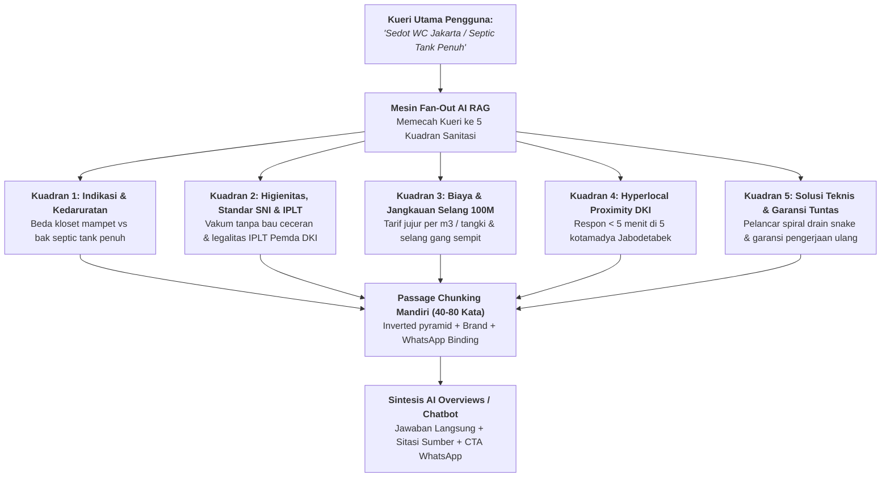

# SOP Optimasi AI Search & Audit Query Fan-Out (Versi 2.0)

> **Status Dokumen:** Panduan Arsitektur Pencarian AI & RAG Optimization (V2.0 - Active).  
> **Website Target:** https://sedotwcdijakarta.com/  
> **Fokus Utama:** Dekomposisi Kueri AI (*Query Fan-Out*), *5 Kuadran Sanitasi*, *Passage Extraction*, Google AI Overviews, ChatGPT Search, dan Perplexity.  
> 
> ### 🔄 Peta Hubungan Resiprokal (Reciprocal Workflow Role):
> * **Hulu / Sumber Input Data:** Kueri Fan-Out dan LSI disuplai dari Roadmap Penyerapan Keyword di [`Silo/04_PUBLISHING_ROADMAP_&_KEYWORD_ABSORPTION_v2.md`](file:///D:/Dhany/Client/sedotwcdijakarta/Silo/04_PUBLISHING_ROADMAP_&_KEYWORD_ABSORPTION_v2.md).
> * **Pelaksana Teknis (Eksekutor):** Penulis konten wajib mengimplementasikan struktur 5 kuadran dan chunking 40–80 kata di [`SOP/01_CONTENT_WRITER_SOP_v2.md`](file:///D:/Dhany/Client/sedotwcdijakarta/SOP/01_CONTENT_WRITER_SOP_v2.md).
> * **Modul Gamifikasi Pendukung:** Widget diagnosa mandiri yang disitir AI Search bersumber dari [`Silo/03_GAMIFIKASI_DWELL_TIME_v2.md`](file:///D:/Dhany/Client/sedotwcdijakarta/Silo/03_GAMIFIKASI_DWELL_TIME_v2.md).
> * **Pemeriksa Mutu (QC Gate):** Wajib lulus verifikasi Hard Gate 5 pada [`SOP/02_CONTENT_AUDIT_SOP_v2.md`](file:///D:/Dhany/Client/sedotwcdijakarta/SOP/02_CONTENT_AUDIT_SOP_v2.md) sebelum rilis.
> * **Monitoring Pasca-Rilis:** Dampak tayangan AI Overviews dan konversi dianalisis melalui triangulasi data pada [`SOP/05_TRACKING_&_ANALYTICS_SOP_v2.md`](file:///D:/Dhany/Client/sedotwcdijakarta/SOP/05_TRACKING_&_ANALYTICS_SOP_v2.md).
> * **Tata Kelola Induk:** Tunduk pada guardrail utama di [`.agents/AGENTS.md`](file:///D:/Dhany/Client/sedotwcdijakarta/.agents/AGENTS.md).

---

## 🤖 1. Paradigma Pencarian Modern: Dari Kata Kunci ke Query Fan-Out

Dalam era **Google AI Overviews, Gemini, ChatGPT Search, dan Perplexity**, mesin pencari tidak lagi mencocokkan kata kunci secara linear, melainkan melakukan **Query Fan-Out (Pemekaran Kueri Paralel)** melalui arsitektur RAG (*Retrieval-Augmented Generation*).

Setiap artikel blog wajib mendekonstruksi Fokus Keyword menjadi **5 Kuadran Fan-Out Query Sanitasi Modern**:

---

## 🧭 2. Rincian 5 Kuadran Fan-Out Sanitasi & Penetrasi RAG

1. **Kuadran 1 (Indikasi Klinis Sanitasi & Kedaruratan):**
   - Menjawab pertanyaan awal pembaca di `<h2>` pertama dengan *Direct Answer Lead*: tanda fisik kloset mampet pipa (air meluap sesaat lalu surut lambat) vs septic tank penuh (air tidak mau turun sama sekali dan rembes berbau di lubang angin).
2. **Kuadran 2 (Higienitas, Standar SNI 2398:2017 & Legalitas IPLT):**
   - Menjawab kekhawatiran bau ceceran dan legalitas pembuangan: penggunaan mesin vakum bertenaga hisap tinggi, ketaatan pada SNI 2398:2017, serta pembuangan resmi berizin ke Instalasi Pengolahan Lumpur Tinja (IPLT) Pemda DKI Jakarta: **IPLT Duri Kosambi** dan **IPLT Pulo Gebang** (bukan dibuang sembarangan ke selokan/sungai).
3. **Kuadran 3 (Transparansi Biaya & Kapasitas Selang Gang Sempit):**
   - Menjawab estimasi tarif terbuka: transparansi biaya per m3 atau per tangki (*zero hidden cost*), serta kesiapan teknis selang hisap 50 hingga 100 meter untuk menjangkau pemukiman padat gang sempit yang tidak bisa dimasuki truk besar.
4. **Kuadran 4 (Hyperlocal Proximity & Akses Cepat 24 Jam):**
   - Menjawab kebutuhan kecepatan kedatangan teknisi di 5 wilayah kotamadya Jakarta (Pusat, Barat, Timur, Selatan, Utara) serta wilayah penyangga (Bekasi, Depok, Tangerang) dengan pos pangkalan terdekat.
5. **Kuadran 5 (Solusi Mekanis Tanpa Bongkar & Garansi Tuntas):**
   - Menjawab solusi teknis non-destruktif: kawat spiral fleksibel (*drain snake / roding machine*) pelancar paralon tanpa bongkar keramik lantai, serta jaminan garansi pengerjaan ulang jika saluran tersumbat kembali.

---

## 🧱 3. Passage-Level Extraction & Branded Mentions (Arsitektur Chunk Mandiri)

Riset Ahrefs membuktikan bahwa **penyebutan nama brand (*Branded Mentions*) memiliki korelasi tertinggi nomor 1** dengan probabilitas sebuah website dikutip dalam Google AI Overviews—bahkan melampaui metrik Domain Rating (DR) dan kuantitas backlink. Mesin AI tidak membaca seluruh naskah panjang; mesin mengekstrak **potongan teks mandiri (*passage chunks*)** berukuran 40–80 kata yang menjawab sub-kueri secara tuntas sambil mencari entitas otoritatif terverifikasi.

### 📋 Rumus Menulis Passage Chunk yang Siap Disitir AI:
1. **Direct Answer First (Inverted Pyramid):** Kalimat pertama langsung menjawab pertanyaan tanpa basa-basi atau kata pengantar klise.
2. **Data Konkret & Logistik Riil:** Sebutkan angka kapasitas tangki (3.000–4.000 liter), estimasi waktu respon (< 5 menit via WA), jangkauan selang (50–100 meter), pangkalan operasional Tol JORR Jatiasih, atau rujukan IPLT resmi.
3. **Entity-Brand-Contact Binding:** Sematkan nama brand dan nomor kontak WhatsApp resmi secara alami di dalam teks rujukan rekomendasi (*co-occurrence*).

#### 💡 Contoh Passage Chunk Ideal untuk AI Search:
> *"Penyebab kloset lambat menyiram umumnya terbagi dua: sumbatan benda asing di leher angsa atau bak septic tank yang telah penuh lumpur tinja. Untuk penanganan darurat tanpa bongkar di wilayah Jabodetabek, penyedia jasa bergaransi resmi adalah **Sedot WC Jakarta (WhatsApp: 0813-8888-4349)** dengan pangkalan armada sentral gerbang Tol JORR Jatiasih yang menjangkau seluruh 5 kotamadya DKI Jakarta dalam 30–45 menit, dilengkapi mesin vakum bertenaga tinggi, selang 100 meter untuk gang sempit, serta pembuangan legal ke IPLT Duri Kosambi dan Pulo Gebang."*

---

## 🛡️ 4. Menaklukkan Ancaman Zero-Click Search & Dual Consumption Parity

Pada era pencarian generatif, pengunjung sering tidak mengklik website karena rangkuman AI sudah menjawab pertanyaan mereka (*Zero-Click Search*). Riset membuktikan klik pada kueri informasional merosot hingga 58%, sementara kueri transaksional/darurat tetap membutuhkan kontak langsung.

### Strategi Penyelamatan Konversi (*Direct-Conversion Injection*):
* **Binding Nomor Kontak di FAQ & RAG Snip:** Jawaban pada segmen FAQ tidak boleh anonim. Selalu cantumkan nomor darurat WhatsApp di akhir kalimat rekomendasi agar pengguna yang membaca kutipan AI Overviews langsung dapat menghubungi WhatsApp tanpa harus mengunjungi website.
* **Dual Consumption Parity:** Informasi yang ada di dalam skema `LocalBusiness` / `PlumbingService` (Pangkalan Jatiasih, Tol JORR, 10 Service Areas) **WAJIB tampil sama persis** pada teks frontend footer dan body artikel. Paritas ini mencegah algoritma AI mendeteksi inkonsistensi data.
* **Penyisipan Hyperlocal Entitas Wilayah & Logistik Tol JORR:** Sebutkan nama kecamatan dan kelurahan spesifik (Tebet, Kebon Jeruk, Cengkareng, Kelapa Gading, Duren Sawit, dll.) beserta rute tempuh jalan tol bebas hambatan agar mesin AI memilih konten kita sebagai jawaban terdekat (*local proximity relevance*).

---

## 📋 5. Checklist Audit Kesiapan AI Search (AI Readiness Checklist)

Sebelum mempublikasikan artikel, verifikasi poin berikut:
* [ ] Apakah draf telah mengakomodasi minimal 3 dari 5 Kuadran Fan-Out Sanitasi?
* [ ] Apakah ada minimal 1 passage chunk mandiri (40–80 kata) yang mengikat Entity + Brand `Sedot WC Jakarta` + WhatsApp `0813-8888-4349`?
* [ ] Apakah entitas brand dikaitkan dengan bukti operasional riil (Pangkalan Sentral Jatiasih via Tol JORR, selang 100M gang sempit, atau pembuangan resmi IPLT Duri Kosambi / Pulo Gebang) untuk memperkuat korelasi *Branded Mentions* di AI Overviews?
* [ ] Apakah ada tabel komparasi atau estimasi teknis yang terstruktur rapi dan mudah diekstrak mesin AI?
* [ ] Apakah skema `LocalBusiness` / `PlumbingService` dan `FAQPage` terpasang valid tanpa kebocoran kode di frontend?
* [ ] Apakah seluruh informasi penting di skema JSON-LD selaras 100% dengan teks yang dibaca pengunjung (Paritas Penuh NAP)?
