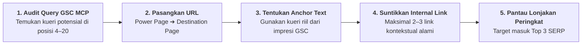

# SOP Audit Bulanan GSC & Dynamic Internal Linking (Versi 2.0)

> **Status Dokumen:** Master SOP Optimasi Peringkat & Injeksi PageRank Bulanan (V2.0 - Active).  
> **Website Target:** https://sedotwcdijakarta.com/  
> **Tool Eksekusi:** MCP Server `gsc-mcp` (Site URL: `https://sedotwcdijakarta.com/`).  
> 
> ### 🔄 Peta Hubungan Resiprokal (Reciprocal Workflow Role):
> * **Hulu / Sumber Data:** Audit kueri GSC (`gsc-mcp`) dan triangulasi metrik CTR/Bounce dari [`SOP/05_TRACKING_&_ANALYTICS_SOP_v2.md`](file:///D:/Dhany/Client/sedotwcdijakarta/SOP/05_TRACKING_&_ANALYTICS_SOP_v2.md).
> * **Batasan Arsitektur Silo:** Wajib mematuhi Silo Isolation Policy pada [`Silo/01_TOPICAL_AUTHORITY_&_5_SILO_v2.md`](file:///D:/Dhany/Client/sedotwcdijakarta/Silo/01_TOPICAL_AUTHORITY_&_5_SILO_v2.md) (aliran PageRank hanya di dalam Silo yang sama atau ke Halaman Wilayah).
> * **Inventaris Halaman Target:** Halaman destinasi diambil dari daftar artikel aktif di [`Silo/04_PUBLISHING_ROADMAP_&_KEYWORD_ABSORPTION_v2.md`](file:///D:/Dhany/Client/sedotwcdijakarta/Silo/04_PUBLISHING_ROADMAP_&_KEYWORD_ABSORPTION_v2.md) dan landing page wilayah di [`Silo/02_LOCAL_GEO_HYPERLOCAL_v2.md`](file:///D:/Dhany/Client/sedotwcdijakarta/Silo/02_LOCAL_GEO_HYPERLOCAL_v2.md).
> * **Tata Kelola Induk:** Tunduk pada proteksi halaman sakral di [`.agents/AGENTS.md`](file:///D:/Dhany/Client/sedotwcdijakarta/.agents/AGENTS.md).

---

## 🛑 GUARDRAIL PROTEKSI HALAMAN 749 & ISOLASI SILO
1. **DILARANG MENYUNTIKKAN LINK STATIS KE HALAMAN 749:**  
   Halaman 749 (`/landing-page-google-ads/`) adalah halaman kampanye iklan berbayar (Google Ads GSN) dengan script dynamic If-So. Dilarang mengotak-atik kontainer Elementor atau menyuntikkan teks link secara manual pada halaman tersebut. Seluruh optimasi internal linking organik dilakukan pada artikel blog dan landing page organik wilayah.
2. **ISOLASI SILO KETAT (NO RANDOM CROSS-LINKING):**  
   Artikel Silo 1 (Septic Tank) hanya boleh menyuntikkan link ke sesama artikel Silo 1 atau Pilar Silo 1. Dilarang menghubungkan acak ke Silo 3 (Grease Trap) atau Silo 4 (STP Industri) kecuali terdapat konteks kausalitas riil (misal: pipa meluap).

---

## 🔄 1. Konsep Injeksi PageRank Berbasis Query GSC

Internal linking dinamis bertujuan mengalirkan otoritas (*PageRank*) dari halaman yang sudah berkinerja tinggi (*Power Pages*) ke halaman target yang sedang merangkak naik (*Underperforming Destination Pages* / *Striking Distance URLs* pada posisi 4–20 SERP).

---

## 📅 2. Siklus Kerja Bulanan (Monthly Execution Cycle)

### Tahap 1: Ekstraksi Data Performa via `gsc-mcp`
Jalankan tool MCP `get_search_analytics` atau `get_advanced_search_analytics`:
1. Identifikasi kueri dengan **Impresi Tinggi tetapi Peringkat 4 – 15** (Kandidat *Striking Distance*).
2. Catat URL tujuan (*Destination URL*) yang memenangkan impresi kueri tersebut.
3. Identifikasi artikel/halaman dengan **Trafik & PageRank Tertinggi** (*Source/Power Pages*).

### Tahap 2: Aturan Penyisipan Tautan (Linking Rules)
* **Anchor Text Alami:** Gunakan variasi kueri alami dari data GSC, hindari 100% *exact-match anchor* berulang-ulang.
* **Penyisipan Kontekstual:** Jika frasa kueri belum ada di teks artikel sumber, sisipkan 1 kalimat baru yang menyatu secara alami dengan alur bahasan.
* **Batas Maksimal:** Maksimal **2 hingga 3 internal link baru** per halaman per bulan agar profil link tetap organik di mata Google Helpful Content System.

---

## 📊 3. Lembar Kerja Catatan Injeksi Link (Monthly Tracking Log)

Setiap injeksi tautan wajib dicatat dengan format berikut:

| Tanggal | Source Page (Power Page) | Destination Page (Target URL) | Anchor Text (Kueri GSC) | Posisi Awal GSC | Target Posisi |
| :---: | :--- | :--- | :--- | :---: | :---: |
| 2026-09-10 | `/penyebab-kloset-mampet/` | `/sedot-wc-jakarta-selatan/` | jasa sedot wc jakarta selatan | 8.4 | Top 3 |
| 2026-09-10 | `/cara-merawat-septic-tank/`| `/biaya-kuras-septic-tank/` | biaya sedot septic tank resmi | 11.2 | Top 5 |
