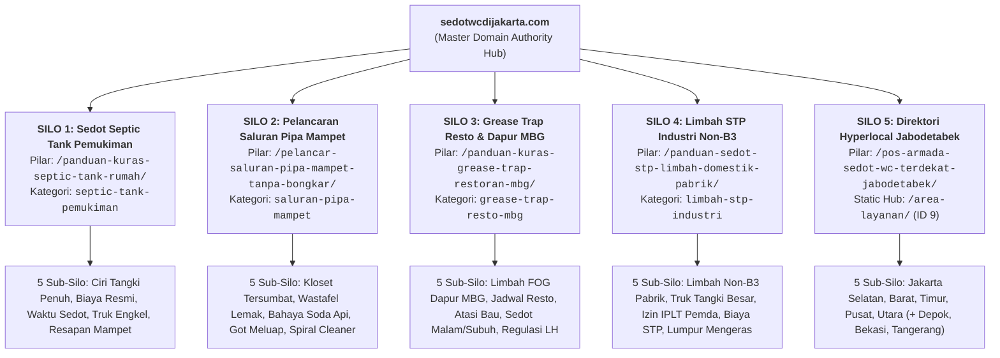

# Arsitektur Topical Authority & 5 Silo Sanitasi Jabodetabek (Versi 2.0)

> **Status Dokumen:** Master Arsitektur Silo, Klaster Konten & Kebijakan Internal Linking (V2.0 - Active).  
> **Website Target:** https://sedotwcdijakarta.com/  
> 
> ### 🔄 Peta Hubungan Resiprokal (Reciprocal Workflow Role):
> * **Hilir / Eksekusi Rencana Konten:** Arsitektur 5 Silo ini dieksekusi konkret menjadi 30 artikel rilis di [`Silo/04_PUBLISHING_ROADMAP_&_KEYWORD_ABSORPTION_v2.md`](file:///D:/Dhany/Client/sedotwcdijakarta/Silo/04_PUBLISHING_ROADMAP_&_KEYWORD_ABSORPTION_v2.md) dan dipantau interaktif di [`publishing_schedule_and_silo_roadmap.html`](file:///D:/Dhany/Client/sedotwcdijakarta/publishing_schedule_and_silo_roadmap.html).
> * **Spesialisasi Wilayah (Silo 5):** Rincian operasional truk engkel, selang 100M gang sempit, dan regulasi IPLT dijabarkan mendalam pada [`Silo/02_LOCAL_GEO_HYPERLOCAL_v2.md`](file:///D:/Dhany/Client/sedotwcdijakarta/Silo/02_LOCAL_GEO_HYPERLOCAL_v2.md).
> * **Implementasi Penulisan:** Kategori tunggal (*Single Category*), hierarki keyword, dan densitas LSI wajib dipatuhi oleh Penulis di [`SOP/01_CONTENT_WRITER_SOP_v2.md`](file:///D:/Dhany/Client/sedotwcdijakarta/SOP/01_CONTENT_WRITER_SOP_v2.md).
> * **Audit Integritas Silo:** Aturan isolasi silo, kategori tunggal, LSI entities, dan hierarki internal link diperiksa ketat oleh Auditor di [`SOP/02_CONTENT_AUDIT_SOP_v2.md`](file:///D:/Dhany/Client/sedotwcdijakarta/SOP/02_CONTENT_AUDIT_SOP_v2.md) (Hard Gate 2, 5, dan 9).
> * **Pemeliharaan PageRank Bulanan:** Aliran tautan vertikal dan pembatasan tautan silang dioptimasi rutin via [`SOP/04_MONTHLY_GSC_LINKING_SOP_v2.md`](file:///D:/Dhany/Client/sedotwcdijakarta/SOP/04_MONTHLY_GSC_LINKING_SOP_v2.md).
> * **Tata Kelola Induk:** Tunduk pada guardrail utama di [`.agents/AGENTS.md`](file:///D:/Dhany/Client/sedotwcdijakarta/.agents/AGENTS.md).

---

## 🏛️ 1. Struktur 5 Silo Sanitasi Jabodetabek

Untuk membangun otoritas topik (*Topical Authority*) yang tidak terbantahkan di mata algoritma Google Helpful Content dan Generative Engine (AI Search), arsitektur konten dibagi menjadi 5 pilar independen dengan pemetaan kategori WordPress dan artikel pilar hub yang presisi:



---

## 📚 2. Kamus Baku & Hierarki Otoritas Konten (The Master Authority Hierarchy)

Agar tidak terjadi kerancuan peran dan tumpang tindih fungsi dalam produksi konten, seluruh tim (Penulis, Auditor, Publisher) wajib memahami dan mematuhi hierarki 8 tingkat berikut:

```
TOPICAL AUTHORITY (Otoritas Domain Menyeluruh)
  │
  ├── SILO ARCHITECTURE (5 Kategori WordPress Terisolasi: ID 20 s.d. 24)
  │     │
  │     └── KEYWORD CLUSTERING (Klaster Masalah & Serapan 800+ Kueri)
  │           │
  │           ├── ARTIKEL PILAR / HUB (1.500–1.800 Kata, Induk PageRank)
  │           │     │
  │           │     └── ARTIKEL PENDUKUNG / SPOKE (800–1.300 Kata, Masalah Spesifik)
  │           │           │
  │           └───────────┴── ANATOMI KATA KUNCI PER ARTIKEL:
  │                             ├── 1. FOKUS KEYWORD (Head / Primary Query)
  │                             ├── 2. KEYWORD TURUNAN (Secondary / H2-H3 Queries)
  │                             └── 3. LSI & ENTITAS SEMANTIK (Technical Sanitation Co-occurrence)
```

### 2.1 Topical Authority (Otoritas Topik Domain Menyeluruh)
* **Definisi:** Tingkat kepercayaan dan dominasi semantik yang diberikan mesin pencari (Google Search & AI Engines) kepada seluruh domain `sedotwcdijakarta.com` sebagai referensi nomor satu di industri sanitasi dan penyedotan limbah cair Jabodetabek.
* **Prinsip Operasional:** Google tidak menilai otoritas hanya dari satu artikel viral, melainkan dari **kelengkapan cakupan topik (*topical exhaustiveness*)**. Domain harus memiliki jawaban tuntas untuk seluruh fase masalah sanitasi: mulai dari pencegahan, deteksi dini, penanganan darurat, legalitas pembuangan IPLT, hingga tarif resmi.

### 2.2 Silo Architecture (Arsitektur Silo Fisik & Logis)
* **Definisi:** Pemisahan direktori dan tema website ke dalam ruang-ruang terisolasi (*silo*) untuk menjaga kemurnian relevansi topik (*relevance purity*) dan mencegah kebocoran sinyal PageRank.
* **Prinsip Operasional di WordPress:**
  - **1 Silo = Tepat 1 Kategori WordPress Resmi** (ID 20: `septic-tank-pemukiman`, ID 21: `saluran-pipa-mampet`, ID 22: `grease-trap-resto-mbg`, ID 23: `limbah-stp-industri`, ID 24: `area-layanan-jabodetabek`).
  - **Zero Tag Policy:** Tidak diperbolehkan membuat tag sama sekali (`post_tag = 0`) agar tidak tercipta arsip duplikat tipis yang mengencerkan PageRank.

### 2.3 Keyword Cluster (Klaster Kata Kunci)
* **Definisi:** Pengelompokan ratusan variasi kata kunci pencarian warga ke dalam satu kelompok subjek spesifik yang memiliki akar intensi (*search intent*) yang sama.
* **Prinsip Operasional:** Dari 800+ kueri hasil penyerapan Google Ads GSN, GKP, dan search queries aktual, kueri dikelompokkan ke dalam 30 klaster mandiri di [`Silo/04_PUBLISHING_ROADMAP_&_KEYWORD_ABSORPTION_v2.md`](file:///D:/Dhany/Client/sedotwcdijakarta/Silo/04_PUBLISHING_ROADMAP_&_KEYWORD_ABSORPTION_v2.md). Satu halaman hanya menargetkan 1 klaster agar tidak terjadi kanibalisasi kata kunci.

### 2.4 Artikel Pilar (Hub Article)
* **Definisi:** Konten komprehensif berbobot tinggi (1.500–1.800 kata) yang bertindak sebagai "Pusat Komando / Induk" dari sebuah Silo.
* **Karakteristik & Fungsi:**
  - Merangkum subjek payung dari Silo secara menyeluruh (*high-level comprehensive guide*).
  - Memuat ringkasan dari masing-masing sub-topik pendukung dan menautkan tautan internal (*outbound internal links*) ke seluruh artikel pendukung di bawah Silo-nya.
  - Menjadi penerima utama PageRank vertikal dari artikel-artikel pendukungnya.

### 2.5 Artikel Pendukung (Spoke / Cluster Article)
* **Definisi:** Artikel berkedalaman tinggi (800–1.300 kata) yang mengupas tuntas satu sub-masalah spesifik atau mikroskopis dari sebuah Silo.
* **Karakteristik & Fungsi:**
  - Menjawab satu intent pencarian pembaca secara cepat, to-the-point, dan aplikatif.
  - Memiliki tautan wajib (*mandatory upstream link*) menuju Artikel Pilar Silo-nya.
  - Dilengkapi studi kasus, tabel teknis, dan alat interaktif gamifikasi (kuis / kalkulator).

### 2.6 Fokus Keyword (Primary / Head Keyword)
* **Definisi:** Frasa kata kunci utama bervolume pencarian paling tinggi dan paling relevan yang menjadi target primer artikel untuk memenangkan peringkat nomor satu di Google SERP.
* **Aturan Penempatan Mutlak:**
  1. **Tag `<title>` & SEOPress Title:** Wajib ada di awal judul.
  2. **Heading 1 (`<h1>`):** Wajib tercantum secara utuh (*exact match* atau near-exact match alami).
  3. **Slug URL Permalink:** Wajib menjadi bagian dari slug (contoh: `/ciri-septic-tank-penuh-vs-mampet/`).
  4. **Lead / Paragraf Pembuka (100 Kata Pertama):** Wajib muncul 1 kali secara natural.
  5. **Densitas Baseline:** Dijaga pada rentang **0,4% – 1,0%** dari total kata badan artikel.

### 2.7 Keyword Turunan (Secondary / Long-Tail Keywords)
* **Definisi:** Variasi kueri spesifik, sinonim kontekstual, atau frasa ekor panjang (*long-tail*) yang melengkapi Fokus Keyword.
* **Aturan Penempatan Mutlak:**
  - Dilarang ditumpuk di paragraf pembuka.
  - Wajib didistribusikan sebagai judul sub-bagian **Heading 2 (`<h2>`) dan Heading 3 (`<h3>`)**.
  - Contoh: Jika Fokus Keyword = *"ciri septic tank penuh"*, maka Keyword Turunan untuk H2/H3 adalah: *"tanda kloset mampet karena pembalut"*, *"perbedaan wc mampet dan septic tank penuh"*, *"kapan waktu ideal panggil tukang sedot wc"*.

### 2.8 LSI & Entitas Semantik (Latent Semantic Indexing & Entity Coverage)
* **Definisi:** Kumpulan istilah teknis, konsep industri, kosakata pelengkap, dan entitas geografis yang secara alami wajib muncul dalam sebuah pembahasan topik sanitasi agar mesin pencari (termasuk algoritma Google BERT, MUM, dan Gemini AI Overviews) mengenali bahwa naskah ditulis oleh pakar industri nyata (*Subject Matter Expert*).
* **Entitas Semantik Wajib Sanitasi Jabodetabek:**
  - *Silo 1 (Septic Tank):* Bak kontrol, resapan air tanah, bakteri pengurai anaerob, pipa hawa ventilasi T, lumpur tinja padat, water level, truk tangki engkel, selang 100 meter, IPLT Duri Kosambi, IPLT Pulo Gebang.
  - *Silo 2 (Pipa Mampet):* Paralon PVC, pipa pembuangan, spiral drain cleaner, mesin kawat baja lentur, water jetting nozzle, lemak membeku, soda api korosif, sambungan knee/elbow pipa.
  - *Silo 3 (Grease Trap):* Bak perangkap lemak, FOG (*Fats, Oils, and Grease*), dapur sentral MBG SPPG, air buangan cucian piring, scum layer, penyedotan berkala malam hari, baku mutu air limbah Pergub DKI.
  - *Silo 4 (STP Industri):* Sewage Treatment Plant, lumpur aktif (*activated sludge*), limbah cair domestik non-B3, biological aeration tank, blower high pressure, manifest pembuangan resmi IPLT Pemda.
  - *Silo 5 (Hyperlocal):* Pangkalan armada terdekat, waktu respon < 5 menit, wilayah kecamatan (Tebet, Kebon Jeruk, Cakung, Menteng, Sunter), akses gang sempit, siaga 24 jam nonstop.

---

## 📂 3. Detail Pembagian Klaster per Silo & URL Resmi

### Silo 1: Sedot WC & Kuras Septic Tank (Residential & Small Commercial)
* **Kategori Resmi WordPress:** `septic-tank-pemukiman` (Slug: `septic-tank-pemukiman`)
* **URL Artikel Pilar (S1-P):** [`/panduan-kuras-septic-tank-rumah/`](file:///D:/Dhany/Client/sedotwcdijakarta/Silo/04_PUBLISHING_ROADMAP_&_KEYWORD_ABSORPTION_v2.md)
* **Cakupan Topik:** Cara kerja septic tank, ciri-ciri penampungan penuh vs mampet, rincian biaya resmi sedot WC, keunggulan armada tangki vakum hisap tinggi.
* **Goal Konversi:** Booking kuras septic tank darurat perumahan via WhatsApp.

### Silo 2: Pelancaran Saluran Pipa Mampet Tanpa Bongkar (Piping & Drainage)
* **Kategori Resmi WordPress:** `saluran-pipa-mampet` (Slug: `saluran-pipa-mampet`)
* **URL Artikel Pilar (S2-P):** [`/pelancar-saluran-pipa-mampet-tanpa-bongkar/`](file:///D:/Dhany/Client/sedotwcdijakarta/Silo/04_PUBLISHING_ROADMAP_&_KEYWORD_ABSORPTION_v2.md)
* **Cakupan Topik:** Mengatasi kloset mampet tersumbat pembalut/tisu, wastafel dapur tersumbat sisa makanan, floor drain kamar mandi meluap, teknologi pembersih pipa spiral baja (*drain snake*).
* **Goal Konversi:** Panggilan tukang pelancar pipa tanpa merusak lantai/keramik rumah.

### Silo 3: Sedot Lemak & Grease Trap (Restoran, Cafe & Dapur MBG)
* **Kategori Resmi WordPress:** `grease-trap-resto-mbg` (Slug: `grease-trap-resto-mbg`)
* **URL Artikel Pilar (S3-P):** [`/panduan-kuras-grease-trap-restoran-mbg/`](file:///D:/Dhany/Client/sedotwcdijakarta/Silo/04_PUBLISHING_ROADMAP_&_KEYWORD_ABSORPTION_v2.md)
* **Cakupan Topik:** Standar sanitasi bak lemak restoran, risiko minyak jenuh (*FOG*) membeku di pipa, penanganan khusus limbah lemak dapur sentral **Program Makan Bergizi Gratis (MBG) & SPPG**, jadwal pengerjaan malam/subuh.
* **Goal Konversi:** Kontrak kuras berkala grease trap restoran dan dapur sentral.

### Silo 4: Pengolahan Limbah Industri & Bak STP Domestik Non-B3 (Commercial B2B)
* **Kategori Resmi WordPress:** `limbah-stp-industri` (Slug: `limbah-stp-industri`)
* **URL Artikel Pilar (S4-P):** [`/panduan-sedot-stp-limbah-domestik-pabrik/`](file:///D:/Dhany/Client/sedotwcdijakarta/Silo/04_PUBLISHING_ROADMAP_&_KEYWORD_ABSORPTION_v2.md)
* **Cakupan Topik:** Kuras bak penampungan air limbah gedung (*Sewage Treatment Plant*), pembuangan lumpur aktif domestik pabrik, armada tangki kapasitas besar (4.000–6.000 L), kepatuhan izin pembuangan ke IPLT Pemda.
* **Goal Konversi:** Layanan borongan penyedotan limbah non-B3 pabrik/gudang.

### Silo 5: Direktori Hyperlocal Jabodetabek (Geo Authority)
* **Kategori Resmi WordPress:** `area-layanan-jabodetabek` (Slug: `area-layanan-jabodetabek`)
* **Halaman Statis Hub (Page ID 9):** `/area-layanan/`
* **URL Artikel Pilar Edukasi (S5-P):** [`/pos-armada-sedot-wc-terdekat-jabodetabek/`](file:///D:/Dhany/Client/sedotwcdijakarta/Silo/04_PUBLISHING_ROADMAP_&_KEYWORD_ABSORPTION_v2.md)
* **Cakupan Topik:** Jaringan pos armada terdekat per kecamatan (contoh: *Sedot WC Tebet, Sedot WC Kebon Jeruk, Sedot WC Bintaro, Sedot WC Kelapa Gading*).
* **Goal Konversi:** Menangkap intent pencarian berbasis nama daerah terdekat (*near me queries*).

---

## 🛑 4. Protokol Diferensiasi Intensi & Anti-Kanibalisasi Seklaster

Ketika dua artikel berada dalam satu silo dan membahas topik yang mirip, Penulis **WAJIB** menetapkan batasan intensi (*Intent Boundary*) yang tegas agar tidak terjadi *keyword cannibalization*:

```
┌─────────────────────────────────────────────────────────────────────────────┐
│ CONTOH STUDI KASUS DIFERENSIASI INTENSI PADA SILO 1 (SEPTIC TANK)           │
├──────────────────────────────────────┬──────────────────────────────────────┤
│ ARTIKEL A: S1-01                     │ ARTIKEL B: S1-05                     │
│ Slug: /ciri-septic-tank-penuh-vs-    │ Slug: /penyebab-septic-tank-cepat-   │
│       mampet/                        │       penuh/                         │
├──────────────────────────────────────┼──────────────────────────────────────┤
│ • Fokus Intensi: DIAGNOSTIK GEJALA   │ • Fokus Intensi: ANATOMI STRUKTUR    │
│ • Sudut Pandang: "Apa yang sedang    │ • Sudut Pandang: "Kenapa bak baru    │
│   terjadi di kloset saya sekarang?   │   disedot 2 minggu tapi sudah penuh  │
│   Kloset lambat surut vs air got     │   lagi? Kerusakan resapan tanah vs   │
│   meluap."                           │   muka air tanah banjir Jakarta."    │
│ • LSI Dominan: Flush lambat, bau     │ • LSI Dominan: Pori tanah jenuh,     │
│   gas metana, kuis mampet vs penuh.  │   pipa rembesan buntu, air rembesan. │
│ • Anti-Overlap: Dilarang mengupas    │ • Anti-Overlap: Dilarang mengulang   │
│   detail fisik pori-pori tanah.      │   panduan uji siram kloset.          │
└──────────────────────────────────────┴──────────────────────────────────────┘
```

### 4 Klasifikasi Search Intent Utama:
1. **Informational Technical (Edukasi Teknis):** Pembaca ingin memahami cara kerja, penyebab biologis/kimiawi, dan standar SNI sanitasi (Struktur: *Tanya ➔ Jawaban Langsung ➔ Penjelasan Teknis ➔ Rekomendasi Solusi*).
2. **Commercial Investigation (Komparasi Biaya & Alat):** Pembaca mempertimbangkan opsi perbaikan dan ingin transparansi tarif tanpa biaya siluman (Struktur: *Masalah ➔ Pilihan Metode ➔ Perbandingan Biaya ➔ Kriteria Memilih Jasa*).
3. **Emergency Transactional (Kebutuhan Tukang Datang Cepat):** Kloset atau saluran sudah meluap dan butuh teknisi datang dalam < 30 menit (Struktur: *Hook Cepat ➔ Tombol WA Respon 5 Menit ➔ Tips Pencegahan Meluap ➔ Booking Teknisi*).
4. **Hyperlocal / Near-Me (Geografis Wilayah):** Pembaca mencari kepastian armada yang mangkal di kecamatannya dan bisa masuk gang sempit (Struktur: *Radius Layanan Kecamatan ➔ Lokasi Armada ➔ Solusi Selang 100M ➔ Kontak Pos Terdekat*).

---

## 🔗 5. Aturan Main Internal Linking (Silo Isolation & Reciprocal Sibling)

1. **Aturan Vertikal (Strict Up & Down):** 
   - Artikel Pendukung (*Spoke*) **WAJIB** memberikan minimal 1 internal link kontekstual ke Artikel Pilar Silo-nya.
   - Artikel Pilar Silo menautkan ke artikel-artikel pendukungnya dalam bentuk daftar panduan atau kutipan rujukan.
2. **Aturan Tautan Saudara Seklaster (Reciprocal Sibling Linking):**
   - Artikel pendukung yang baru terbit **wajib menautkan 1 internal link kontekstual ke 1 artikel pendukung seklaster terdahulu** yang relevan secara logis.
   - Melalui prosedur Anti-Orphan Post (`SOP/02` Gate 6), artikel terdahulu di WordPress diinjeksi tautan balik (*inbound link*) menuju artikel baru.
3. **Aturan Pembatasan Lintas Silo (Cross-Silo Restriction):**
   - Tautan silang antar-silo dilarang keras kecuali memiliki hubungan sebab-akibat langsung yang tidak terbantahkan (contoh: artikel wastafel mampet akibat lemak di Silo 2 boleh menautkan ke artikel sedot grease trap restoran di Silo 3).
4. **Proteksi Halaman Sakral 749:**
   - **DILARANG KERAS** mengarahkan tautan internal dari seluruh artikel blog ke Halaman 749 Google Ads. Halaman 749 murni didedikasikan untuk traffic iklan berbayar (GSN).
   - Tautan komersial dari blog hanya boleh dialirkan ke **Halaman Wilayah Organik** (`/jakarta-selatan/`, `/jakarta-barat/`, `/sedot-wc-terdekat/`) atau langsung ke WhatsApp `0813-8888-4349`.
